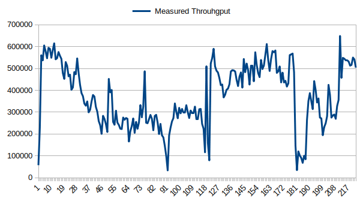
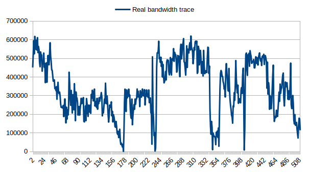
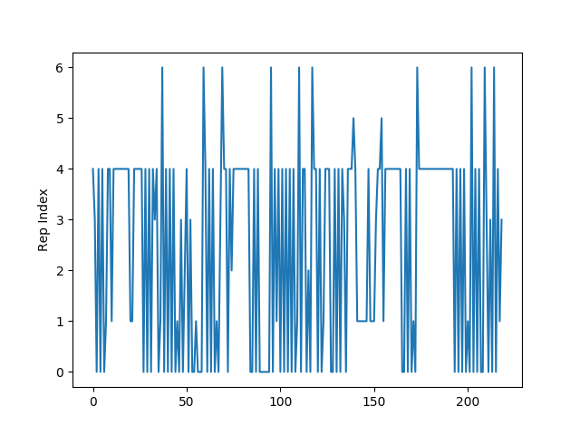
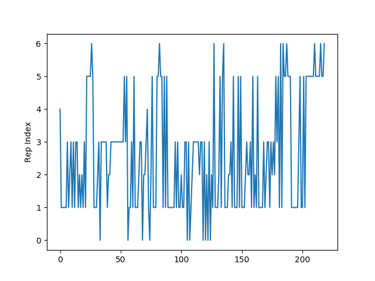
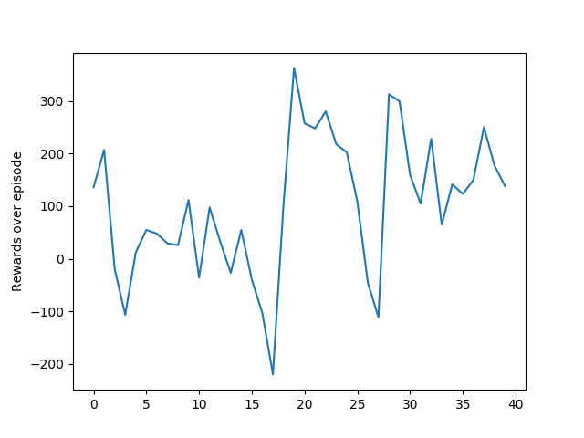

Introduction
============
This repo implements reinforcement learning adaptation algorithms based on ns3 simulation and opengym-ai environment. I am using ns3-gym and dash meets ns3 modudle from [1] and [2].  

Added features
============
- Limit buffer size to maxBuffer,normaly the client will have a limited buffer size. But the original implementation in [1] allows clients to have unlimited buffer during playback which make client's behaviors unrealistic.
- Bandwidth fluctuation. Adaptive bitrate algorithms are design to cope with varying throughput therefore in the simulation, the throughput between client and server should be varied over time. 
- Q-learning adaptation algorithm: a new RL-based adaptation algorithm is added. The action value function after learning are saved to local file for later use.


Installation
============
1. After cloning this repo, follow instruction in [1] to install pre-required packages.
```
#run after installation
cd RL-DASH
```
2. Run rl-tcp test to make sure the installation success.
```
# Terminal 1:
./waf --run "rl-tcp --transport_prot=TcpRl"

# Terminal 2:
cd ./scratch/rl-tcp/
./test_tcp.py --start=0
```
3. Clone https://github.com/peterbangert/dash-meets-ns3gym [2] into contrib folder of ns3-gym
```
git clone https://github.com/peterbangert/dash-meets-ns3gym
```
4. Build:
```
#run under ns3-gym folder
./waf configure
./waf 
```

Examples
========
1. Running heureustic algorithms (festive, panda...):
```
./waf --run="tcp-stream-bitrate --simulationId='testbw' --maxBuffer=50000000 --numberOfClients=1 --adaptationAlgo=festive --segmentDuration=2000000 --bitRate=100 --bwfile=contrib/bwtrace1.txt --segmentSizeFile=contrib/dash-meets-ns3gym/segmentSizes.txt"
```
2. Running RL algorithms:
```
#1st terminal:
./waf --run="tcp-stream-bitrate --simulationId='testbw' --maxBuffer=50000000 --numberOfClients=1 --adaptationAlgo=rl-algorithm --segmentDuration=2000000 --bitRate=100 --bwfile=contrib/bwtrace1.txt --segmentSizeFile=contrib/dash-meets-ns3gym/segmentSizes.txt"
#2nd terminal:
cd ns3-gym/contrib/dash-meets-ns3gym/ns3gym/pensive
python3 pensive.py
```
3. Training RL algorithms: 
```
#1st terminal
./start-clients.sh 
#can change the argument in the start-clients.sh file
#2nd terminal
cd ns3-gym/contrib/dash-meets-ns3gym/ns3gym/
python3 paris.py
```
#### Parameters 
- simulationId : string, simulation id (for logging purpose)
- maxBuffer : int, maximum capacity of clients' buffer
- numberOfClients: int, number of clients
- segmentDuration: uint_32, The duration of a segment in microseconds.
- bitRate: uint_32, default datarate value
- bwfile: string, path to bandwidth trace file for shaping bandwidth from server to accesspoint. Bandwidth will change to value specific in txt file every 1 second. The structure of the bwtrace1.txt should be:  
12321  
34234  
23233  
- adaptationAlgo: string, adaptation algorithm name, pre-installed are festive, panda, tobasco, pensive(RL)[2]
- segmentSizeFile: The relative path (from the ns-3.x/ folder) of the file containing the sizes of the segments of the video. The segment sizes have to be provided as a (n, m) matrix, with n being the number of representation levels and m being the total number of segments. A two-segment long, three representations containing segment size file would look like the following:
	1564 22394  
	1627 46529  
	1987 121606 

Test result
===========
The measured throughput at client and the bandwidth from txt file are shown in figure below: 
 <p align="center">

</p>

 <p align="center">

</p>
please keep in mind that the bandwidth will change every 1 second and throughput is measured every time a segment is successfully downloaded. Therefore the values of measured throughput and value in the txt file are not identical but the shape looks similar. We need to take in to account also the ns3 simulator only set the bandwidth from server to access point, client will never perceive the exact bandwidth.
 <p align="center">

</p>
 <p align="center">

</p>
The images above show the selected representation index for each segment for testing video at episode 1 and episode 170. after 50 episodes, the agent is able to avoid request heavy representation in the beginning which cause buffer overun.
This is the reward over 50 episodes.
 <p align="center">

</p>

REFERENCES
============

[1] https://github.com/tkn-tub/ns3-gym  
[2] https://github.com/peterbangert/dash-meets-ns3gym  
[3] https://github.com/haraldott/dash  
[4] NS3 tutorial: https://www.nsnam.org/docs/tutorial/html/conceptual-overview.html#a-first-ns-3-script  